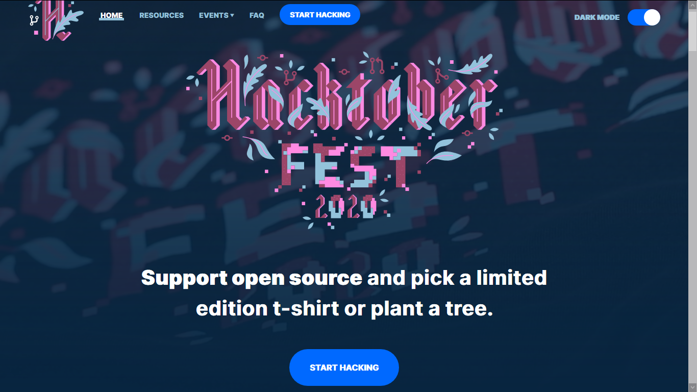
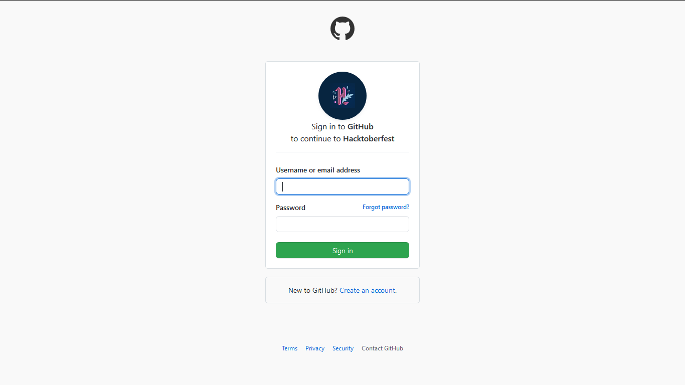
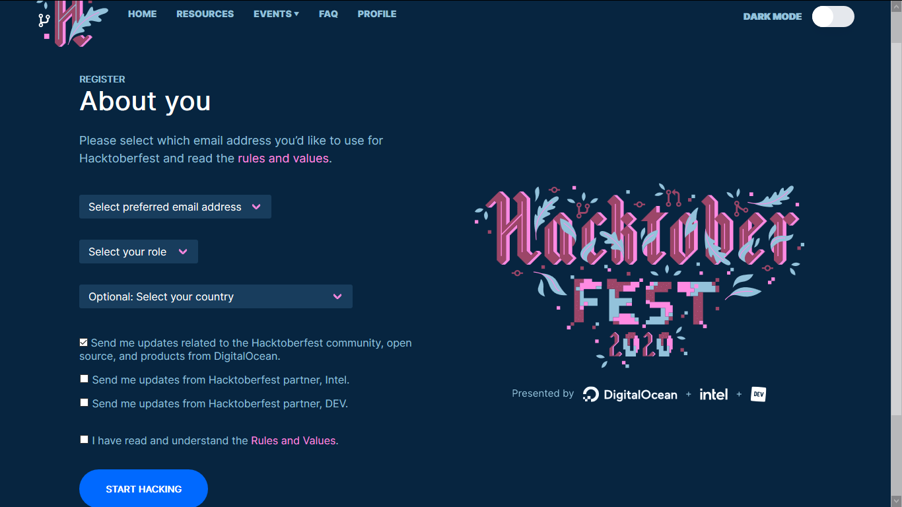
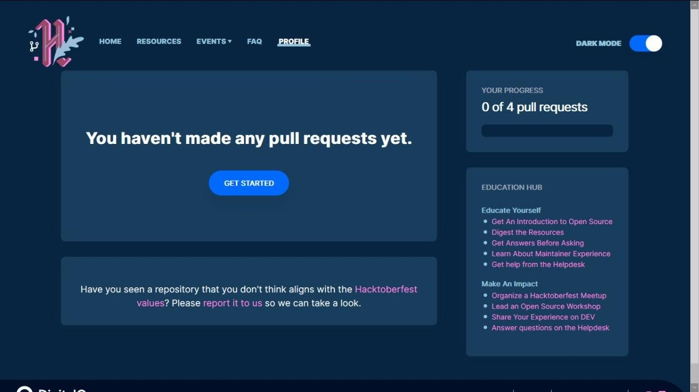
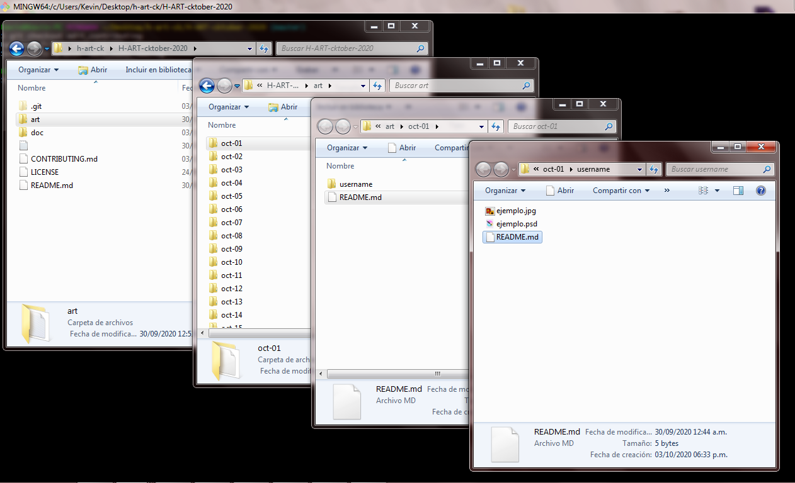
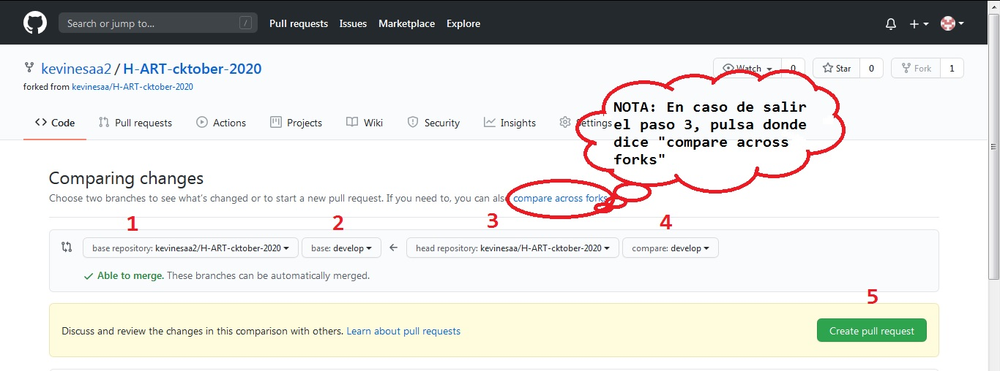

[Español](CONTRIBUTING.md)

# How to contribute to 2020 H-ART-cktober

- [Restrictions](#restrictions)
- [Sign up to GitHub](#sign-up-to-github)
- [Sign up to Hacktoberfest](#sign-up-to-hacktoberfest)
- [Required software](#software)
- [Send your art](#send-your-art)
- [Additional recommendations](#additional-recommendations)

<a name="restrictions"/>

### Restrictions 

Each added file must weight 50 MB maximum.

Every resource used like fonts, images and other, must have a copyright free license.

Add both the final result and the source files, as well as any other additional resource for it's reproduction, like fonts or others.

<a name="sign-up-to-github"/>

### Sign up to GitHub

To be able to create a pull request, is required to have an account on Github, to do so, go ahead to it's [sign up](http://github.com/join) page, and follow the steps.

**1.- Enter your basic information**

**2.- Check that you're not a robot :robot:.**

**3.- Press the "Sign Up" button.**

**4.- Setup the basic settings.**

**5.- Check out your email, then click on the link that you've received on it to validate your account.**

**6.- ¡Congratulations, you have a Github account! :tada:**

<a name="sign-up-to-hacktoberfest"/>

### Sign up to Hacktoberfest 

In order for your pull requests to be taken into account for Hacktoberfest, and get your t-shirt, you must be registered in its [web](https://hacktoberfest.digitalocean.com/); Follow these steps to finish your registration.

**1.- Press the Start Hacking button**

**2.- Sign in with your Github account**

**3.- Fill the Hacktoberfest form**

**4.- ¡Congratulations, you're registered for the Hacktoberfest!! ¡Let the pull requests begin! :tada:**

<a name="software"/>

### Required software

In order to create a pull request, is required for you to have [Git](https://git-scm.com/) installed in your computer.

After installing Git, you've got to install [Git LFS](https://git-lfs.github.com/).

Optionally, you can install some GUI for Git, such as [Source Tree](https://www.sourcetreeapp.com/), [Git Kraken](https://www.gitkraken.com/), [GitHub Desktop](https://desktop.github.com/).

<a name="sending-your-art"/>

### Sending your art

**You'll always have to create your pull request against the develop branch, not the master one.**

Start forking this repository.

In order to know if you're looking at the fork you've just done, or the original
 repository, you can take a look at the top-left corner of your screen. The forked
 repository title starts with your username, followed by the repository name; it also includes
 the text **forked from**, with the original repository and user name.
 

Then, click the green **code** button, and copy the HTTPS URL from the textblock.

Make a new folder on your computer, and open Git on it.

The next step is to clone the fork into the folder you've just created.
To do so, write the following command in the git console:

`git clone fork_url` 

where `fork_url` goes the previous copied URL; Then press Enter.

Open the git's console inside the just cloned repository.

Configure Git with your basic information. First, add your email address, typing the following:

`git -config --local user.email "my_email@domain.com"` 

where `my_domain@domain.com` is the email address you used to sign up to Github
 Then, add your name by typing the following:

`git -config --local user.name "Name and surname"`

**Note: All the previous steps, must only be realized once.
 Everything from now, must be done for each pull request you make**

<a name="new-pr"/>

Switch to the develop branch, by typing the command:

`git checkout develop`

Create a new branch starting from the develop one. Note: for this example we'll use the name *branch_name*.

`git branch branch_name`

Inside the art folder, and inside the one with the day corresponding to the day when you make your contribution, create a new folder with your Github username.
Note: for this example we'll use the username *user_name*.

Save the corresponding files into the new folder.
It's recommended to include a README.md file, where you can write a brief description, which program to use to open the resources, and any other information that you think it's important.

Once you finish, you have to tell Git to track your files, to save your changes into the Git index, and update those changes in Github.

To tell Git to track your files, open Git inside the folder where they're, and type the following command:

`git add .` 

then press Enter.

To save your changes into the Git index, you have to create a commit, to do so, write the following command:

`git commit -m "message"` 

where `message` goes a brief description of your contribution.

To update the changes in Github, you just have to push them, to do so, type the following command:

`git push origin branch_name` 

Now, you just have to create a pull request to the original repository.

Go to the forked repository on Github, there, look for the branch you just pushed to and select it.

Then, select the **Pull requests** option

Them, press the **new pull request** button

(1) Select the repository you want to create the pull request against (it beigns with the other's username),
 (2) followed by the branch you want to pull request agains (for this repository, you must always have to create pull requests against the develop branch);
 (3) select your repository, the one which starts with your username,
 (4) and select the branch you want to send changes to the original one, namely, the one which you pushed previously
  
Then, press the **create pull request** button

You have to add a title for your pull request, and optionally you can add a more detailed description; Then press the **Create pull request** button

:tada: If you get to here, you've just created your first pull request, congratulations! :tada:

Do you want to know more about how a Pull Request is made? Visit https://www.digitalocean.com/community/tutorials/how-to-create-a-pull-request-on-github

<a name="additional-recommendations"/>

# Additional recommendations

If you have any other questions, you can create an [Issue](https://github.com/kevinesaa/H-ART-cktober-2020/issues) asking for whatever you want.

- [Creating develop_2](#creating-develop-2)
- [Syncing your fork](#syncing-your-fork)
- [Syncing the files in your computer](#syincing-local-files)
- [Before creating another pull request](#before-creating-another-pull-request)

<a name="creating-develop-2"/>

### Creating develop_2

The develop_2 branch is totally optional, and is intended to have all of your
 creations into a single branch, while you wait for your pull request to be
 merged into the main repository, syncing your fork and the local repository.

Open a git console inside of the repository main folder.
Then, switch to the **develop** branch by typing:

`git checkout develop`

Now, create the *develop_2* branch by typing:

`git branch -b develop_2`

In order to add a branch changes into the develop_2 branch, you have to switch to it by typing:

`git checkout develop_2`

Then, add the changes from the other branch by using a **merge**:

`git merge branch_name`

You can go through all these steps after each pull request, to keep all your files on a single branch.
After each *merge* is recommended to delete the merged branch as well; do so by typing:

`git branch -D branch_name`

see that the `-D` flag, must be written in CAPS.

If you wish, you can add the *develop_2* branch to your Github's fork as well, by executing a push like:

`git push origin develop_2`

Consider that before pushing your changes, you have to be in the Git console, and on the branch you want
to update on Github; to be sure, just run: `git checkout develop_2`

También es recomendable que borres la rama de tus archivos en Github, luego hacer el pull request, para ello puedes escribir lo siguiente: 

`git push --delete origin branch_name`

<a name="syncing-your-fork"/>

### Syncing your fork

Syncing your fork with the original repository, is simmilar to creating a pull request. First, you have to go to the fork on Github and look for the pull request option.

Then, press the **New pull request** button

Then,
 (1) Select the repository you want to pull request to, in this case, you'll select your own, the one that begins with your username.
 (2) Then, you have to select the branch you want to update
 (3) Select the original repository, the one that begins with the other user's username
 (4) Then select the branch you want to update your repository; is recommended that the branch from the step (2) and (4) are the same one.

Then press the **Create pull request** button.

Note: If when selecting the branch on the step (2), the repository (step 3) option dissappears, click the **compare across forks** button.

Here, you have to set a title for your pull request, and optionally you can add a longer description; Then press the **Create pull request** button.

This will create an entry in the your repository's pull request section, look for it and open it.

Now, you just need to make a *merge*; Press the **Merge pull request** button, and then **Confirm merge**.

:tada: Congratulations! if everything went well, you have your fork and the original repository synced :tada:

<a name="syncing-locally"/>

### Syncing your local files

Open a Git console on the repository main folder (on your computer).
Then, switch to the branch you want to sync (in this case, we'll use the **develop** branch) by typing:

`git checkout develop`

Then, we'll update the branch by typing:

`git pull`

By doing this, we'll have this branch's files sync locally in our computer.

<a name="before-creating-another-pull-request"/>

### Before creating another pull request

Check that you're on the **develop** branch before getting started. To do so you can type:

`git checkout develop` .

If you've [synced your fork](#syncing-your-fork), is remcommended to sync your local files as well by typing `git pull`.

If you wish, you can delete the branch you've been working with previously by runing:

`git branch -D branch_name`

Optionally, you can delete the same branch, but in the fork:

`git push --delete origin branch_name`

From now, you just have to repeat some steps to create a new pull request, specifically starting from [here](#nuevo-pr)
